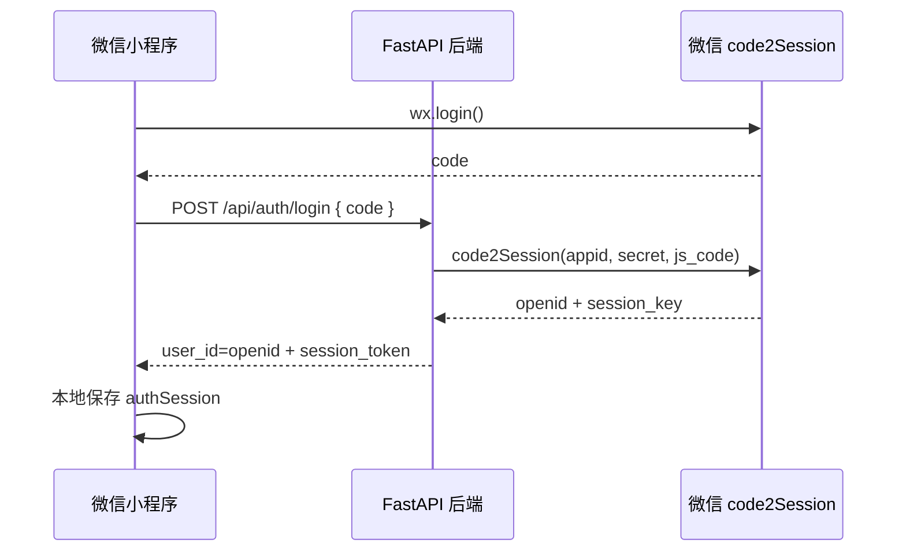
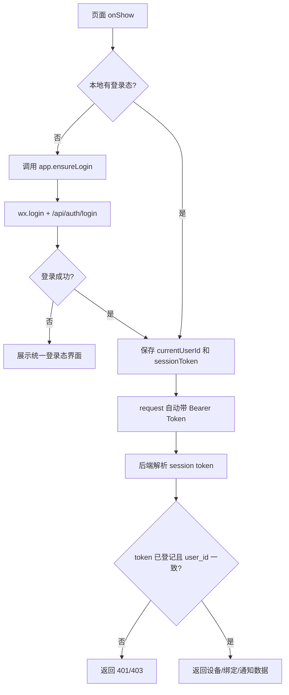
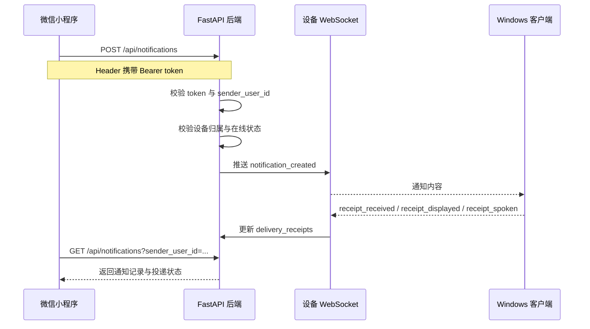
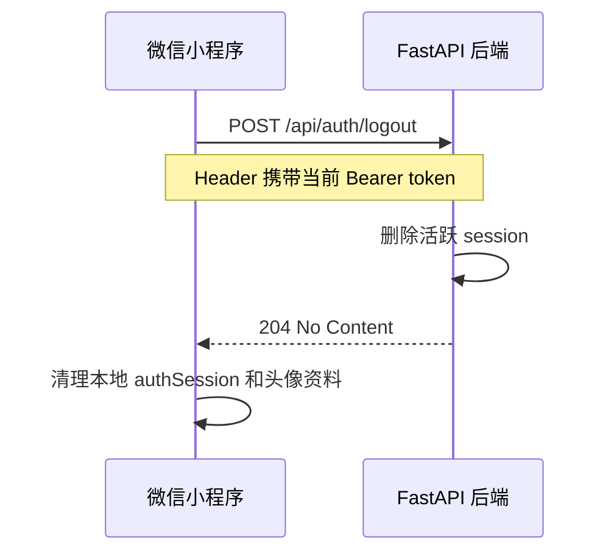

# Auth And Notification Flow

## 1. 微信登录时序图

## 2. 业务访问流程

## 3. 通知发送与回执流程

## 4. 关键约束

- `openid` 当前直接作为 `user_id`
- 小程序所有用户侧业务请求都必须携带 `Authorization: Bearer <session_token>`
- 后端不仅校验 token 签名，还校验该 token 已登记为活跃会话，并且 token 中解析出的用户和请求体/路径中的 `user_id` 一致
- 设备注册、心跳、WebSocket 连接仍属于客户端链路，不走小程序登录态

## 5. 注销流程

