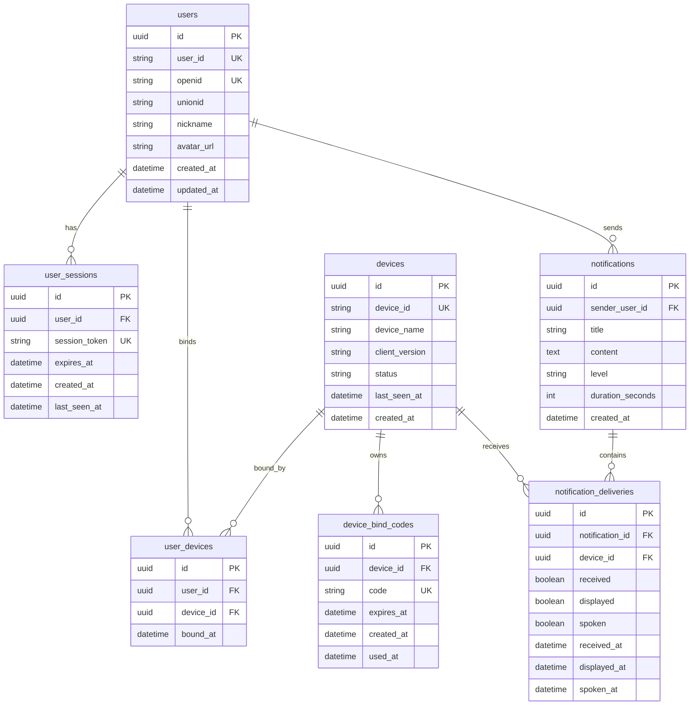

# Database Design

## 1. 设计目标

当前项目核心业务围绕“微信用户 <-绑定-> Windows 设备 <-接收-> 通知记录”。

虽然现阶段后端仍以 `InMemoryStore` 为主，但后续落库建议直接围绕以下实体展开：

- 微信身份用户
- 用户会话
- 设备与绑定码
- 用户设备绑定关系
- 通知主表
- 通知投递明细

建议目标数据库：`PostgreSQL`

## 2. ER 图

## 3. 表设计建议

### `users`

- `user_id`: 对外业务 ID，可先直接等于 `openid`
- `openid`: 微信唯一标识，必须唯一索引
- `unionid`: 可选，用于未来多端统一身份
- `nickname` / `avatar_url`: 来自小程序点击授权后的资料

### `user_sessions`

- 保存后端签发的会话 token
- 推荐字段：`expires_at`、`last_seen_at`
- 便于未来支持主动注销、失效、风控审计

### `devices`

- 对应 Windows 客户端设备
- `device_id` 对外唯一
- `status` 建议枚举：`online` / `offline`

### `device_bind_codes`

- 存放短期绑定码
- 一个设备可多次生成绑定码，但只允许一个有效绑定码处于可用状态

### `user_devices`

- 用户与设备多对多关系表
- 当前业务接近“一台设备属于一个用户”，但关系表更易扩展
- 需要联合唯一索引：`(user_id, device_id)`

### `notifications`

- 存通知主记录
- 未来建议补充：`duration_seconds`、`enable_speech`、`created_by_platform`

### `notification_deliveries`

- 一条通知对多台设备会生成多条投递记录
- 建议联合唯一索引：`(notification_id, device_id)`

## 4. 推荐索引

- `users(openid)` unique
- `users(user_id)` unique
- `user_sessions(session_token)` unique
- `user_sessions(user_id, expires_at)`
- `devices(device_id)` unique
- `device_bind_codes(code)` unique
- `device_bind_codes(device_id, expires_at)`
- `user_devices(user_id, device_id)` unique
- `notifications(sender_user_id, created_at desc)`
- `notification_deliveries(notification_id, device_id)` unique

## 5. 落库顺序建议

1. 先落 `users` 和 `user_sessions`
2. 再替换当前内存里的 `devices` / `user_devices` / `device_bind_codes`
3. 最后落 `notifications` 和 `notification_deliveries`

这样可以优先把“真实登录”和“设备归属”从内存态迁到可持久化结构，风险最低。
